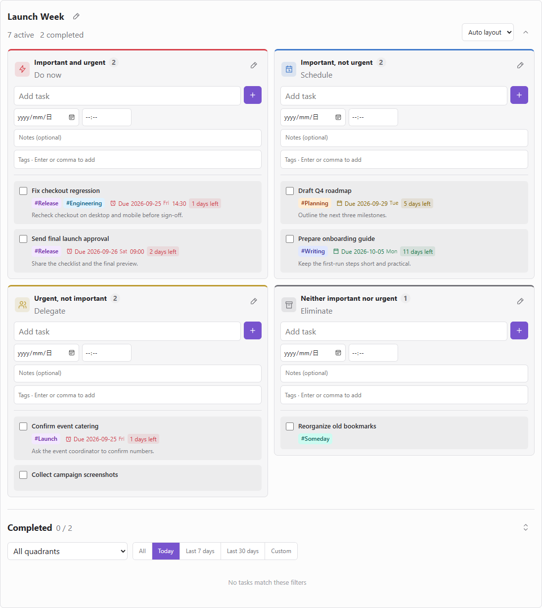
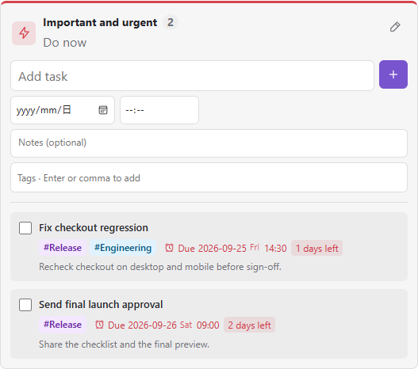
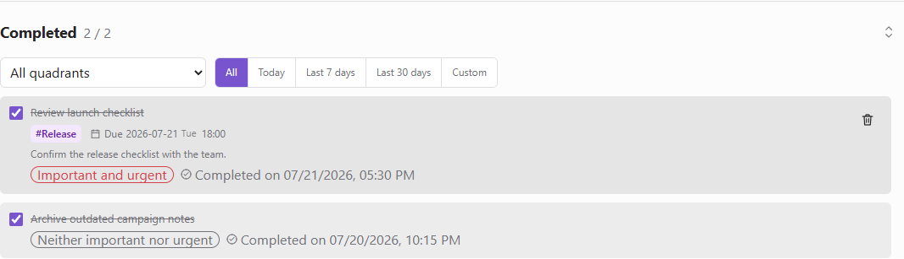

<p align="right"><strong>English</strong> | <a href="https://github.com/AngusK97/obsidian-eisenhower-matrix-blocks/blob/main/README.zh-CN.md">简体中文</a></p>

# Eisenhower Matrix Blocks for Obsidian

[](https://github.com/AngusK97/obsidian-eisenhower-matrix-blocks/actions/workflows/ci.yml)
[](https://github.com/AngusK97/obsidian-eisenhower-matrix-blocks/releases)
[](https://github.com/AngusK97/obsidian-eisenhower-matrix-blocks/blob/main/LICENSE)

**Eisenhower matrices that live inside your Obsidian notes.**

Prioritize work by importance and urgency without leaving your notes. Add deadlines, optional times, colored tags and notes; drag tasks into place and keep a filterable completion history. Each board belongs to its note, not a separate task database.

**Obsidian 1.5.0+ · Desktop and mobile · English and 中文 · Local-first**

[Quick start](#quick-start) · [Install & update](#installation) · [Task details](#task-details) · [Layout & history](#layout-and-completed-history) · [FAQ](#frequently-asked-questions) · [Changelog](CHANGELOG.md)

<picture>
  <source media="(prefers-color-scheme: dark)" srcset="docs/assets/renderer-overview-dark.png">
  <source media="(prefers-color-scheme: light)" srcset="docs/assets/renderer-overview-light.png">
  
</picture>

*Version 2.8.1 renderer preview, using [fictional launch-planning tasks](docs/demo/Matrix%20Demo.md). The browser harness simulates the Obsidian shell and icons; your theme, native date picker and device may look different. [Media details](docs/assets/README.md).*

- **Local to every note:** each matrix owns its tasks and completed history, and a note can contain more than one matrix.
- **Markdown-backed:** tasks, quadrants, ordering, and completion times travel with the note through Obsidian Sync, Remotely Save, or Git.
- **A complete workflow:** add, edit, move, complete, restore, delete, and filter tasks without leaving the matrix.
- **Readable task cards:** distinct task backgrounds, compact metadata and a fixed divider between quick-add and the scrolling list.
- **Flexible space:** responsive quadrants, a collapsible board summary and scrollable completed history.

The matrix is inserted at the editor cursor and remains part of the note.

## Quick start

1. [Install the plugin](#installation) and enable **Eisenhower Matrix Blocks** in Obsidian.
2. Open an editable Markdown note and place the cursor where the matrix should appear.
3. Click the grid icon in the left ribbon, or run **Eisenhower Matrix Blocks: Insert matrix at cursor** from the command palette.
4. Use Live Preview or Reading view to work with the rendered matrix.

Each insertion creates a separate matrix. Run the command again when you want another matrix in the same note.

The default quadrants are **Do** (important and urgent), **Schedule** (important, not urgent), **Delegate** (urgent, not important), and **Eliminate** (neither). These are organizational labels: moving a task to Delegate does not send it to another person.

## Installation

### Community Plugins

1. Open **Settings → Community plugins** in Obsidian.
2. Select **Browse** and search for **Eisenhower Matrix Blocks**.
3. Select **Install**, then **Enable**.

### Manual installation

1. Download `main.js`, `manifest.json`, and `styles.css` from the [latest release](https://github.com/AngusK97/obsidian-eisenhower-matrix-blocks/releases/latest).
2. Create `<Vault>/.obsidian/plugins/eisenhower-matrix-blocks/`.
3. Copy the three files into that folder.
4. Reload Obsidian and enable **Eisenhower Matrix Blocks**.

### Updating

In **Settings → Community plugins**, check for updates and update this plugin on each device. For a manual update, replace the same three files with files from **one release**, then reload the plugin or Obsidian; leave your notes and `data.json` intact. Do not use GitHub's automatic **Source code** ZIP as an installable plugin package.

Back up your notes before upgrading. **Update all devices to 2.7.0 or later before editing tags or deadline times:** older versions can discard those fields when saving. Usage notes and previews reflect [2.8.1](https://github.com/AngusK97/obsidian-eisenhower-matrix-blocks/releases/tag/2.8.1). See the [changelog](CHANGELOG.md) for changes.

## Boards belong to notes

Each matrix belongs to the note that contains it:

- A project note can own its own matrix and completion history.
- The same note can contain multiple independent matrices.
- Copying a matrix block to another note copies its data. Within the **same note**, use the insertion command for another board: duplicating a block repeats its board ID and prevents safe editing.
- Deleting the block deletes that matrix; keep note history or backups.
- Every operation updates only the selected matrix block and preserves surrounding prose, frontmatter, callouts, code, and sibling matrices.
- The plugin makes no network requests and collects no telemetry.

## Core workflow

| Workflow | Behavior |
|---|---|
| Add | Add a title, optional deadline/time, tags and notes in any quadrant. Only a title is required; new tasks appear at the top. |
| Edit | Click any active or completed task to edit all fields. Enter in the title saves; Ctrl/Cmd+Enter in notes saves; Enter in tags adds a tag. |
| Move and order | Drag tasks between quadrants or above and below one another. Touch and pen use the drag handle; the task menu remains available on every device. |
| Complete | Check a task to move it into the unified completed list with an exact completion timestamp. |
| Restore | Uncheck a completed task to return it to the bottom of its source quadrant. |
| Filter | Completed history defaults to today; choose all dates, 7 days, 30 days, or a custom range and source quadrant. |
| Manage space | Collapse the whole matrix to a count summary. Completed history defaults to bounded scrolling; toggle to full height when needed. |
| Rename | Give every embedded matrix its own title; `Matrix` is the default. |
| Customize quadrants | Edit each quadrant title and subtitle independently, or restore its language-aware defaults. |

## Task details

| Field | Required? | Display and editing |
|---|---|---|
| Title | Yes | Wraps naturally; click the task to edit. |
| Deadline date | No | Full `YYYY-MM-DD`, English weekday abbreviation and relative days. |
| Deadline time | No | Optional `00:00`–`23:59`; requires a date and stays hidden when unset. |
| Tags | No | Unlimited, deterministic-color chips; long labels truncate on cards. |
| Notes | No | Multiline editor with a one-line card preview; truncation does not delete text. |

<picture>
  <source media="(prefers-color-scheme: dark)" srcset="docs/assets/renderer-task-details-dark.png">
  
</picture>

*Close-up of the same fictional renderer preview.*

### Deadlines and urgency

Due dates use your device's local calendar. Cards show the complete date and weekday (Mon–Sun), optional 24-hour time, days remaining and a one-line notes preview. These are separate wrapping units, not one long sentence. The date, weekday, time and relative-day text share the same urgency color.

The date control is a single native date field: use its platform calendar or enter a date directly, without a second calendar button. Its appearance depends on your platform. Clearing the date also clears its time; the time can be cleared separately.

The time-clear action stays inside the time field's shared border and is hidden without reserving space when the field is empty. It appears for a filled or incomplete time; clearing keeps the date and returns focus to the time input. Quick-add and the task editor use the same control, with a 44px clear target on mobile.

| Unfinished deadline | Appearance |
|---|---|
| Overdue, today, or within 3 calendar days | Red, with an alarm icon |
| 4–7 calendar days away | Yellow |
| More than 7 calendar days away | Green |
| Completed task, regardless of date | Muted deadline date/weekday/optional time; no countdown or urgent alarm |

Completed tasks keep their original deadline and completion timestamp, but no longer show overdue days, days remaining or "Due today". Restoring a task to a quadrant restores its relative-day label and urgency color. This changes only the display, not stored dates.

The task's deadline is labeled **Due**, with a calendar or urgent alarm icon. The actual completion timestamp appears separately beside the source quadrant, labeled **Completed on** with a circle-check icon. Common actions use consistent icons with accessible names and hover descriptions; filters retain text labels. The completed-list expand button changes its height, not its date filter.

The alarm is a **visual status indicator, not a notification or reminder**. Days and colors are based on the local calendar date, not hours remaining. The optional time is displayed as entered; it is not converted between time zones.

### Tags and keyboard shortcuts

Tags have no count limit. Enter, comma or newline adds tags; the final unconfirmed entry is also saved. Remove tags with their × button. Each normalized tag maps deterministically to the same color on every device, with separate readable light/dark palettes. Tags are task-local text, not entries in Obsidian's global tag index.

Tags are case-sensitive (`Work` and `work` are different); identical normalized tags are deduplicated. Different tags can share a palette color. Both English and Chinese commas are supported. There is no tag filter or global tag-management screen.

| Focused field | Key | Result |
|---|---|---|
| Title, in quick-add or the editor | Enter | Add or save the task |
| Notes | Enter | Insert a new line |
| Notes | Ctrl/Cmd + Enter | Add or save the task |
| Tags | Enter | Add a tag, without submitting the task |

IME composition is respected, so confirming Chinese text does not prematurely submit the task.

## Layout and completed history

- Choose **Auto layout**, **2 × 2 grid**, or **Vertical** from the selector beside the matrix collapse button. This affects only the current matrix view, never your note width or other matrices.
- **Auto** preserves responsive behavior: a single column when matrix content is **620px or narrower**, or the app viewport is **720px or narrower**; otherwise two columns. **Vertical** always uses one column.
- **2 × 2 grid** keeps two columns at least 300px wide for readable tasks. When space is tight, scroll horizontally inside the matrix; the note and completed history remain full-width. Focus the quadrant region to scroll with arrow keys, or drag a task to an edge to auto-scroll between columns. Narrow cards retain full titles and deadline details, with truncated tags/notes available in the editor; the grip opens task actions without a duplicate more button.
- Each quadrant has a fixed quick-add area and divider above its independently scrolling task list. On touch screens, drag from the grip; tapping the grip opens task actions. On desktop, hover or focus a task to reveal its controls.
- Completed history defaults to **Today** and **limited-height scrolling**. Filters use the **completion date**, not the deadline. Choose All to see older completed tasks; the expand/scroll button switches between full height and a scrollable list.
- Collapse the board to show its title, quadrant names/counts and completed count.

Layout choice, collapse state, filters, scroll-display mode and unsaved input are temporary view state, not synced task data. Reopening or recreating the view can reset them; save a draft before leaving the note. Switching layout itself preserves live inputs, including an unconfirmed tag.

<picture>
  <source media="(prefers-color-scheme: dark)" srcset="docs/assets/renderer-completed-dark.png">
  
</picture>

*Version 2.8.1 fictional renderer preview with the All date filter selected to show historical completions. The default filter remains Today.*

## Markdown-backed by design

Existing Markdown matrices remain compatible with the new optional fields. Legacy 1.x global storage uses a separate backup-and-migration path; retain backups when upgrading.

The note contains all persistent board and task data in an `eisenhower-matrix-blocks` code block:

<details>
<summary>View a minimal storage example (normally generated by the insertion command)</summary>

````markdown
```eisenhower-matrix-blocks
<!-- quadrant-board {"id":"board-example","version":2,"title":"Launch Week"} -->

## Important and urgent
- [ ] Fix checkout regression #quadrant/do
  <!-- quadrant-task {"id":"task-example","quadrant":"do","createdAt":"2026-07-20T08:00:00.000Z","completedAt":null,"order":0} -->

## Important, not urgent

## Urgent, not important

## Neither important nor urgent

## Completed
```
````

</details>

The English headings inside the source are stable storage markers. The rendered interface follows the Chinese or English language selected in plugin settings.

Hidden Markdown comments preserve custom quadrant labels, source quadrants, ordering, timestamps and optional `dueDate`, `dueTime`, `tags` and `notes`. Use the insertion command and matrix controls to keep this data valid; do not remove these comments as unused HTML.

## Storage and sync

All data for a matrix is stored in its Markdown block.

- Obsidian Sync, Remotely Save, and Git can sync matrices as ordinary note content.
- Multiple offline edits still follow the conflict behavior of the selected sync provider.
- Deleting a matrix code block deletes that matrix, so note history and backups remain important.

Interface language is stored separately from matrix data. Changing it does not rewrite notes and may need to be configured on each device, depending on your sync settings.

## Mobile and languages

The matrix uses a responsive layout on Obsidian Mobile. Drag from a task's handle to move it while edge auto-scroll keeps long quadrants and notes reachable. Task menus still let you move tasks between quadrants or raise and lower them without a drag gesture.

Open **Settings → Eisenhower Matrix Blocks → Interface language** and choose **Follow Obsidian** (the default), **中文**, or **English**. Labels, menus, relative dates, completion-time formatting and notices update without rewriting matrix blocks. Deadline dates remain `YYYY-MM-DD` and weekdays remain `Mon`–`Sun` in both languages.

Use the pencil button in a quadrant header to edit its title and subtitle. Custom labels are note content, so they stay unchanged when the interface language changes; restoring defaults makes that quadrant follow the interface language again.

## Frequently asked questions

### Can I put more than one matrix in a note?

Yes. Run the insertion command again whenever you need another matrix.

### Will my tasks sync between devices?

Matrix data lives in the note, so it follows the note through your sync provider. Plugin settings such as interface language are separate and depend on whether that provider syncs Obsidian configuration files.

### Can I edit the Markdown manually?

The format is readable, but the insertion command and matrix controls are recommended because they maintain task metadata. If a matrix block is incomplete or malformed, fix its source before continuing.

### Does it work without an internet connection?

Yes. The plugin runs locally and makes no network requests.

### Why is the matrix vertical on my desktop?

The note pane may be narrower than the responsive breakpoint, even in a maximized window. See [Layout and completed history](#layout-and-completed-history). You do not need to change the vault-wide note width to use the plugin.

### Why did older completed tasks disappear?

The default history filter is Today. Select All and check the source-quadrant filter; filtering does not delete tasks.

### I see a code block instead of a matrix. What should I check?

Enable the plugin and use Live Preview or Reading view. Source mode intentionally shows Markdown. If there is a duplicate-ID or malformed-data warning, back up the note and correct the block before editing; create additional boards in the same note with the insertion command.

### Does it import every checkbox in my vault or send reminders?

No. It manages only tasks inside its own matrix blocks. It does not aggregate vault-wide tasks, provide background notifications or integrate with calendar services.

## Contributing

Bug reports and feature requests are welcome. Please use fictional or sanitized examples and never upload a complete personal vault.

[Report a bug or request a feature](https://github.com/AngusK97/obsidian-eisenhower-matrix-blocks/issues). Include plugin/Obsidian versions, platform, theme, expected behavior and a minimal reproducible example.

See [CONTRIBUTING.md](https://github.com/AngusK97/obsidian-eisenhower-matrix-blocks/blob/main/CONTRIBUTING.md) for the development setup, compatibility requirements, privacy rules, and verification checklist.

```bash
npm ci
npm run verify
```

Use Node.js 22. For a safe UI preview with synthetic data, run `node scripts/ui-preview.cjs`; see [browser QA instructions](tests/browser/README.md). Preview screenshots are not a substitute for testing inside Obsidian on real devices.

## License

[MIT](https://github.com/AngusK97/obsidian-eisenhower-matrix-blocks/blob/main/LICENSE)
