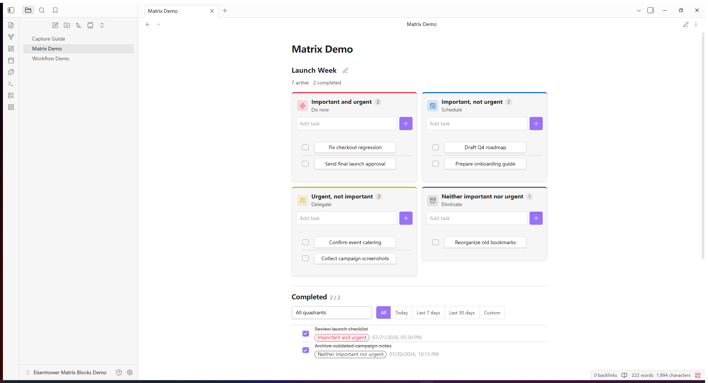
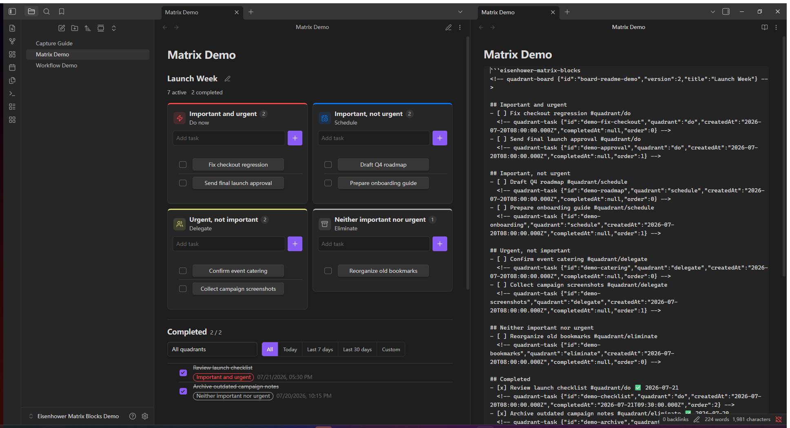

<p align="right"><a href="README.md">English</a> | <strong>简体中文</strong></p>

# Eisenhower Matrix Blocks：Obsidian 四象限任务插件

[](https://github.com/AngusK97/obsidian-eisenhower-matrix-blocks/actions/workflows/ci.yml)
[](https://github.com/AngusK97/obsidian-eisenhower-matrix-blocks/releases)
[](LICENSE)

**把四象限任务管理直接放进 Obsidian 笔记。**

你可以在任意 Markdown 笔记中插入一张独立的艾森豪威尔矩阵，就地添加、调整和完成任务，并按象限或时间筛选完成记录。每张矩阵都属于当前笔记，不依赖全局任务数据库。

<picture>
  <source media="(prefers-color-scheme: dark)" srcset="docs/assets/matrix-desktop-dark.png">
  <source media="(prefers-color-scheme: light)" srcset="docs/assets/matrix-desktop-light.png">
  
</picture>

- **矩阵之间互不影响：** 任务和完成记录只属于所在矩阵；同一篇笔记也可以插入多张矩阵。
- **数据保存在 Markdown 中：** 象限、任务顺序和完成时间都会随笔记一起同步和备份。
- **操作集中在矩阵内：** 添加、编辑、移动、完成、恢复、删除和筛选任务都不需要离开当前笔记。

矩阵会插入当前光标位置，成为笔记内容的一部分，而不是另行打开一个全局任务面板。

## 快速开始

1. [安装插件](#安装方式)，然后在 Obsidian 中启用 **Eisenhower Matrix Blocks**。
2. 打开一篇可编辑的 Markdown 笔记，将光标放在需要插入矩阵的位置。
3. 点击左侧功能区中的网格图标，或在命令面板中运行 **Eisenhower Matrix Blocks：在当前光标处插入四象限**。
4. 切换到实时预览或阅读视图，即可使用渲染后的矩阵。

每次执行插入命令都会新建一张矩阵，并为它分配独立 ID。需要在同一篇笔记中加入第二张矩阵时，再执行一次命令即可。

## 安装方式

插件目前尚未正式上架 Obsidian 社区插件市场。在审核通过前，可以通过 BRAT 或 GitHub Release 安装。

### 通过 BRAT 安装

1. 安装社区插件 [BRAT](https://github.com/TfTHacker/obsidian42-brat)。
2. 在 BRAT 中选择 **Add beta plugin**。
3. 输入 `AngusK97/obsidian-eisenhower-matrix-blocks`。
4. 打开 Obsidian 的 **设置 → 第三方插件**，启用 **Eisenhower Matrix Blocks**。

### 手动安装

1. 打开[最新版本页面](https://github.com/AngusK97/obsidian-eisenhower-matrix-blocks/releases/latest)，下载 `main.js`、`manifest.json` 和 `styles.css`。
2. 在 Obsidian 库中创建 `.obsidian/plugins/eisenhower-matrix-blocks/` 文件夹。
3. 将下载的三个文件放入该文件夹。
4. 重新加载 Obsidian，然后在第三方插件列表中启用 **Eisenhower Matrix Blocks**。

## 为什么不是全局任务面板

不少任务插件会把整个库中的任务汇总到数据库或独立页面。Eisenhower Matrix Blocks 则把每篇笔记作为独立的数据范围：

- 每篇项目笔记都可以拥有自己的矩阵和完成记录。
- 同一篇笔记可以放置多张互不影响的矩阵。
- 复制矩阵代码块就会连同数据一起复制；删除代码块也会删除对应矩阵。
- 不需要维护插件专用的全局任务文件。
- 操作矩阵时，只会更新当前代码块；正文、属性、Callout 块、其他代码和同文件中的其他矩阵都会原样保留。
- 插件完全在本地运行，不发送网络请求，也不收集遥测数据。

## 可以做什么

| 操作 | 说明 |
|---|---|
| 添加 | 直接在“重要且紧急”“重要不紧急”“紧急不重要”或“不重要不紧急”象限中添加任务。 |
| 编辑 | 单击任务标题即可原地修改内容。 |
| 移动 | 桌面端和手机端都可以通过任务菜单切换象限；桌面端还支持直接拖拽。 |
| 完成 | 勾选任务后，它会移入统一的已完成列表，并记录具体完成时间。 |
| 恢复 | 取消勾选已完成任务后，任务会回到完成前所在的象限。 |
| 筛选 | 可以按来源象限，以及今天、近 7 天、近 30 天或自定义时间段筛选完成记录。 |
| 改名 | 每张矩阵都可以单独设置标题；默认标题为 `Matrix`。 |

## 所有数据都在 Markdown 里



一张矩阵的完整状态都保存在笔记中的 `eisenhower-matrix-blocks` 代码块里：

````markdown
```eisenhower-matrix-blocks
<!-- quadrant-board {"id":"board-example","version":2,"title":"Launch Week"} -->

## 立即做
- [ ] Fix checkout regression #quadrant/do
  <!-- quadrant-task {"id":"task-example","quadrant":"do","createdAt":"2026-07-20T08:00:00.000Z","completedAt":null,"order":0} -->

## 安排

## 委派

## 舍弃

## 已完成
```
````

代码块中的这些标题是固定的存储标记。矩阵渲染后显示中文还是英文，取决于插件的界面语言设置。

隐藏的 Markdown 注释用于保存任务 ID、所属象限、排序、创建时间和完成时间。建议通过插入命令创建矩阵，并使用界面操作任务，不要手动编写这些元数据。

## 同步与数据安全

插件没有单独的任务数据库。矩阵代码块本身就是全部数据。

- 使用 Obsidian Sync、Remotely Save 或 Git 同步笔记时，矩阵会像其他 Markdown 内容一样随笔记同步。
- 如果多台设备同时离线修改同一篇笔记，冲突仍由所使用的同步工具处理。
- 每次操作前，插件都会读取最新的笔记内容，并通过 Obsidian Vault API 只更新当前矩阵。
- 同一篇笔记中如果出现重复的矩阵 ID，插件会停止写入，避免修改错矩阵；不同笔记可以安全地使用相同 ID。
- 删除矩阵代码块就等于删除这张矩阵，因此建议保留笔记历史或定期备份。

界面语言保存在插件自己的 `data.json` 中，与矩阵数据分开。切换语言不会改写笔记内容；该设置能否在设备间同步，取决于你的同步工具是否包含 `.obsidian` 配置目录。

## 手机端与语言设置

在 Obsidian Mobile 中，四个象限会根据屏幕宽度自动改为单列布局。手机端无法拖动任务时，可以通过任务菜单切换象限。

打开 **设置 → Eisenhower Matrix Blocks → 界面语言**，即可选择 **中文** 或 **English**。切换后，标题、菜单、筛选器、日期、命令和提示会立即更新，但不会改动矩阵代码块。

## 旧版本兼容

- 使用旧插件名称创建的 `quadrant-tasks` 代码块仍然可以正常读取和编辑。
- 从 1.1 版本升级时，原全局 Markdown 任务会在备份后迁移为笔记中的独立矩阵。
- 从 1.0 版本升级时，原 JSON 任务会在备份后写入旧任务笔记中的独立矩阵。
- 迁移备份只保存在当前插件目录中，不会包含在 GitHub Release 的安装文件里。
- 新版本不再提供旧的全局任务页面和全局任务文件设置。

## 常见问题

### 同一篇笔记可以放多张矩阵吗？

可以。每次需要新矩阵时都运行一次插入命令，这样每张矩阵都会获得独立 ID。

### 任务会在不同设备间同步吗？

会。矩阵数据保存在笔记中，因此会随笔记一起同步。界面语言等插件设置单独保存在 `.obsidian` 目录中，是否同步取决于同步工具的配置。

### 插件会扫描整个库中的任务吗？

不会。插件只处理明确插入的矩阵代码块，不会扫描整个库，也不会建立全局任务索引。

### 可以直接编辑 Markdown 源码吗？

可以阅读和手动修改，但更建议使用插入命令和矩阵界面，因为它们会自动维护任务 ID 与时间戳。如果代码块内容不完整、格式错误或存在重复 ID，插件会停止写入，以免破坏数据。

### 没有网络也能使用吗？

可以。插件完全在本地运行，本身不需要联网。

## 参与贡献

欢迎提交问题报告和功能建议。示例内容请使用虚构数据或先做匿名处理，不要上传完整的私人 Obsidian 库。

开发环境、兼容要求、隐私规则和提交前检查，请参阅 [CONTRIBUTING.md](CONTRIBUTING.md)。

```bash
npm ci
npm run verify
```

## 开源许可

[MIT](LICENSE)
